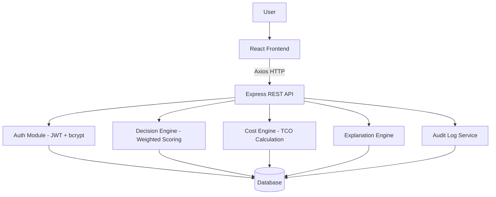

# Cloud Service Model Advisor

## SaaS vs PaaS vs IaaS Technical & Cost Comparison Framework

A MERN-based Cloud Service Model Decision and Cost Analysis Platform that helps organizations evaluate which cloud service model — IaaS, PaaS, or SaaS — is most appropriate for their specific requirements.

---

## Problem Statement

Organizations adopting cloud computing must choose between IaaS, PaaS, and SaaS, but most decision-makers lack the technical knowledge to evaluate which model fits their specific requirements. The choice is often made based on trends, vendor marketing, or incomplete analysis, leading to cost overruns, vendor lock-in, or mismatched infrastructure. There is no accessible, structured, requirement-driven tool that evaluates business, technical, operational, and financial factors simultaneously to produce a transparent recommendation with cost and TCO analysis.

---

## Objectives

1. Build a working web application that evaluates IaaS, PaaS, and SaaS suitability
2. Use a transparent, configurable weighted scoring model
3. Compare estimated costs and calculate 3-year TCO for each model
4. Generate a downloadable decision report
5. Provide role-based access (Admin and Analyst)
6. Maintain audit logs for accountability
7. Serve as an educational tool for cloud service model concepts
8. Demonstrate the decision engine through three industry use cases

---

## Features

- **User Authentication**: JWT-based with bcrypt password hashing
- **Role-Based Access**: Admin and Analyst roles with different permissions
- **Scenario Management**: Full CRUD for cloud decision scenarios with 25+ requirement fields
- **Decision Engine**: Weighted multi-factor scoring (14 factors across 4 categories)
- **Cost Engine**: Illustrative academic cost model with monthly, annual, and 3-year TCO
- **Explanation Engine**: Auto-generated reasons, advantages, and trade-offs
- **Dashboard**: Statistics, charts, recent analyses
- **Results Page**: Scores, ranking, recommendation, confidence, charts
- **Technical Comparison**: IaaS vs PaaS vs SaaS characteristics matrix
- **Responsibility Matrix**: Shared responsibility model display
- **Model Comparison**: Side-by-side factor-by-factor comparison
- **Report Generation**: Downloadable PDF decision report
- **Audit Logging**: All user actions tracked
- **User Management**: Admin can manage user roles
- **Learn Cloud Computing**: 16 cloud concepts with definitions, examples, analogies

---

## Tech Stack

### Frontend
- React.js (TypeScript)
- Tailwind CSS
- React Router
- Recharts (data visualization)
- jsPDF (report generation)
- Lucide React (icons)

### Backend (Reference Implementation)
- Node.js
- Express.js
- MongoDB
- Mongoose
- JWT + bcrypt
- Helmet, CORS, express-rate-limit
- express-validator

### Database (Live Demo)
- Supabase (PostgreSQL) — the live demo uses Supabase for data persistence
- The backend reference code uses MongoDB + Mongoose for the MERN submission

---

## Architecture

```
                    USER
                      |
                      v
               REACT FRONTEND
               (Tailwind, Recharts)
                      |
                      v
                 AXIOS (HTTP)
                      |
                      v
               EXPRESS REST API
                      |
         +--------------+--------------+
         |              |              |
    AUTH MODULE   DECISION ENGINE  COST ENGINE
    (JWT, bcrypt) (scoring logic)  (cost model)
         |              |              |
         +--------------+--------------+
                        |
                        v
                     DATABASE
                 (MongoDB/Supabase)
```

### Mermaid Diagram



---

## Decision Methodology

### Weighted Scoring Model

The decision engine evaluates 14 factors across 4 weighted categories:

| Category | Weight | Factors |
|---|---|---|
| Technical | 40% | Infrastructure Control, Customization, Scalability, Performance, Security, Integration |
| Operational | 25% | Technical Expertise, Management Preference, Maintenance Tolerance, Deployment Speed |
| Financial | 20% | Budget, Cost Sensitivity |
| Business | 15% | Time to Market, Flexibility, Vendor Lock-in Tolerance |

### Scoring System

Each factor is scored 1-5 for each model:
- 1 = Very unsuitable
- 2 = Unsuitable
- 3 = Neutral
- 4 = Suitable
- 5 = Very suitable

Scores are weighted and normalized to a 0-100 scale.

### Confidence

```
difference = topScore - secondScore
>= 15 → High confidence
>= 8  → Moderate confidence
< 8   → Low confidence
```

This confidence indicator is an analytical measure, not a statistical probability.

---

## Cost Methodology

An **illustrative academic cost model** — NOT real AWS/Azure/GCP prices.

### IaaS Costs
- Compute (VMs based on traffic level)
- Storage (based on user count)
- Network (data transfer)
- Backup (15% of storage)
- Management (staff hours × hourly rate)

### PaaS Costs
- App instances (based on traffic)
- Managed database
- Storage + Network
- 25% managed service premium

### SaaS Costs
- Subscription per user (with volume discounts)
- Premium multiplier (based on customization level)
- Storage add-on
- Support plan

### Formulas
```
Annual Cost = Monthly Cost × 12
3-Year TCO = Initial Cost + (Monthly Cost × 36)
```

**Disclaimer**: Illustrative academic cost model. Actual cloud costs vary by provider, region, usage, discounts, contracts, service configuration, and support plans.

---

## Database Design

### Collections/Tables

1. **User/Profile**: name, email, password (hashed), role, timestamps
2. **Scenario**: 25+ requirement fields, createdBy, timestamps
3. **Analysis**: scenarioId, scores, ranking, confidence, reasons, advantages, tradeoffs, factorScores
4. **CostEstimate**: analysisId, model, monthly/annual/TCO costs, assumptions
5. **AuditLog**: userId, action, entity, entityId, metadata, timestamp

### Relationships

```
User 1:N Scenario
Scenario 1:N Analysis
Analysis 1:N CostEstimate
User 1:N AuditLog
```

---

## API Documentation

### Authentication
| Method | Endpoint | Description | Auth |
|---|---|---|---|
| POST | /api/auth/register | Register new user | Public |
| POST | /api/auth/login | Login, returns JWT | Public |
| GET | /api/auth/me | Get current user | Required |

### Users (Admin only)
| Method | Endpoint | Description | Auth |
|---|---|---|---|
| GET | /api/users | List all users | Admin |
| GET | /api/users/:id | Get single user | Admin |
| PUT | /api/users/:id | Update user | Admin |
| DELETE | /api/users/:id | Delete user | Admin |

### Scenarios
| Method | Endpoint | Description | Auth |
|---|---|---|---|
| GET | /api/scenarios | List scenarios | Required |
| POST | /api/scenarios | Create scenario | Required |
| GET | /api/scenarios/:id | Get scenario | Required |
| PUT | /api/scenarios/:id | Update scenario | Required |
| DELETE | /api/scenarios/:id | Delete scenario | Required |

### Analysis
| Method | Endpoint | Description | Auth |
|---|---|---|---|
| POST | /api/analysis/:scenarioId | Run analysis | Required |
| GET | /api/analysis/:scenarioId | Get analysis | Required |

### Dashboard
| Method | Endpoint | Description | Auth |
|---|---|---|---|
| GET | /api/dashboard/stats | Dashboard statistics | Required |

### Reports
| Method | Endpoint | Description | Auth |
|---|---|---|---|
| GET | /api/reports/:analysisId | Generate report | Required |

### Audit Logs
| Method | Endpoint | Description | Auth |
|---|---|---|---|
| GET | /api/audit-logs | List audit logs | Admin |

---

## Installation

### Prerequisites
- Node.js 18+
- MongoDB (for backend reference) or Supabase account (for live demo)

### Frontend Setup
```bash
npm install
npm run dev
```

### Backend Setup (MERN reference)
```bash
cd backend
npm install
cp .env.example .env
# Edit .env with your MongoDB URI and JWT secret
npm run dev
```

### Environment Variables
- `MONGODB_URI`: MongoDB connection string
- `JWT_SECRET`: Secret key for JWT tokens
- `PORT`: Backend server port (default 5000)
- `CLIENT_URL`: Frontend URL for CORS

---

## Demo Scenarios

1. **Custom E-Commerce Platform** — High customization, high scalability → Expected: PaaS
2. **Off-the-Shelf CRM** — Ready-made software, low management → Expected: SaaS
3. **Custom Network Infrastructure** — Very high infrastructure control → Expected: IaaS
4. **Online Learning Platform** — High scalability, low management → Expected: PaaS
5. **Small Business Collaboration Tool** — Ready-made, fast deployment → Expected: SaaS

The recommendation comes from the scoring engine, NOT hard-coded mappings.

---

## Testing

```bash
# Backend tests
cd backend
npm test

# Frontend type checking
npm run typecheck
```

---

## Limitations

- This project is an academic decision-support framework
- It does not replace cloud architects, security teams, or financial analysts
- The scoring model is configurable and based on predefined assumptions
- Cost estimates are illustrative — actual cloud pricing varies
- The confidence indicator is analytical, not statistical

---

## Future Scope

- Real AWS/Azure/GCP pricing API integration
- AI-assisted explanations
- Machine learning recommendation
- Terraform infrastructure generation
- Multi-cloud comparison
- Compliance scoring
- Carbon footprint estimation
- SLA comparison
- Currency conversion
- Cloud migration recommendations

---

## Deployment

### Frontend
Deploy to Vercel, Netlify, or any static hosting platform.
```bash
npm run build
# Deploy the dist/ folder
```

### Backend (MERN reference)
Deploy to Render, Railway, or any Node.js hosting platform.
```bash
cd backend
npm start
```

### Database
- **MongoDB Atlas** for the MERN backend
- **Supabase** for the live demo

### Optional Cloud Deployment
- **AWS**: S3 + CloudFront (frontend), EC2 or Elastic Beanstalk (backend), DocumentDB (MongoDB)
- **Azure**: Static Web Apps (frontend), App Service (backend), Cosmos DB (MongoDB)
- **Google Cloud**: Cloud Storage + Cloud CDN (frontend), Cloud Run (backend), MongoDB Atlas

---

## Project Structure

```
cloud-service-model-advisor/
├── src/                    # Frontend (React + TypeScript)
│   ├── components/         # Reusable UI components
│   ├── pages/             # Route-level pages
│   ├── layouts/           # Layout wrappers
│   ├── services/          # Business logic (engines, API services)
│   ├── config/            # Scoring rules, cost config, demo data
│   ├── context/           # Auth context
│   ├── lib/               # Supabase client
│   └── types/             # TypeScript types
├── backend/               # MERN backend reference
│   ├── controllers/       # Request handlers
│   ├── routes/            # Express routes
│   ├── models/            # Mongoose models
│   ├── services/          # Decision/cost/explanation engines
│   ├── middleware/        # Auth, validation, error handling
│   └── config/            # DB, scoring rules, cost config
├── docs/                  # Documentation
└── README.md
```
